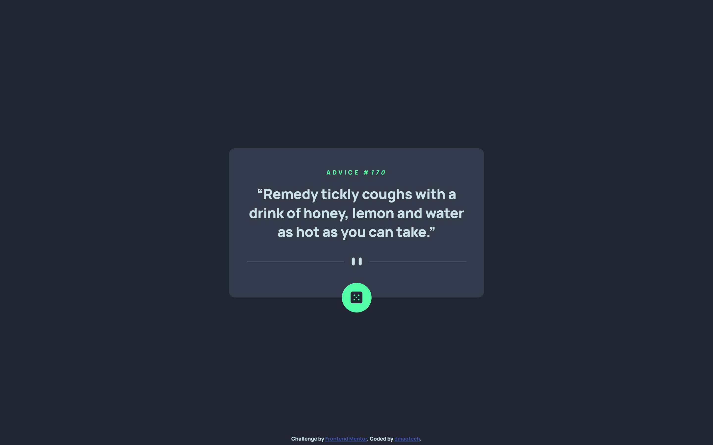

# Frontend Mentor - Advice generator app 

This is a solution to the [Advice generator app challenge on Frontend Mentor](https://www.frontendmentor.io/challenges/advice-generator-app-QdUG-13db). 

## Table of contents

- [Overview](#overview)
  - [The challenge](#the-challenge)
  - [Screenshot](#screenshot)
  - [Links](#links)
- [My process](#my-process)
  - [Built with](#built-with)
  - [Useful resources](#useful-resources)
- [Author](#author)

## Overview

### The challenge

Users should be able to:

- View the optimal layout for the app depending on their device's screen size
- See hover states for all interactive elements on the page
- Generate a new piece of advice by clicking the dice icon

### Screenshot
Desktop Version

### Links

- Solution URL: [https://dmaotech-advice-generator.netlify.app](https://dmaotech-advice-generator.netlify.app)
- Live Site URL: [Soon]()

## My process

### Built with

- Semantic HTML5 markup
- CSS custom properties
- Flexbox
- Mobile-first workflow
- JavaScript
- API Rest

### Useful resources
- API used in this challenge: [AdviceSlip](https://api.adviceslip.com/)

## Author

- Website - [Soon]()
- Frontend Mentor - [@dmaotech](https://www.frontendmentor.io/profile/dmaotech)
- Twitter - [Soon]()
